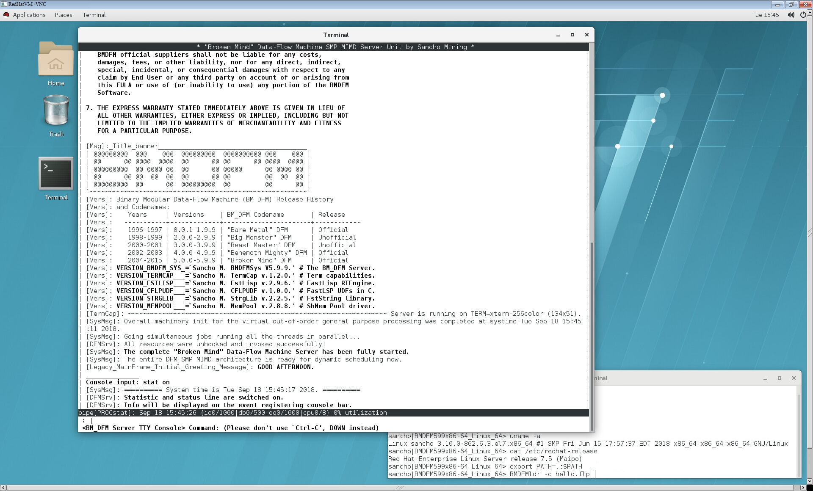

# Binary Modular DataFlow Machine (BMDFM)

Binary Modular DataFlow Machine (BMDFM) is a software package that enables running an application in parallel on shared memory symmetric multiprocessing (SMP) computers using the multiple processors to speed up the execution of single applications. BMDFM automatically identifies and exploits parallelism due to the static and mainly dynamic scheduling of the dataflow instruction sequences derived from the formerly sequential program.

The BMDFM dynamic scheduling subsystem performs a symmetric multiprocessing (SMP) emulation of a tagged-token dataflow machine to provide the transparent dataflow semantics for the applications. No directives for parallel execution are needed.

More info: http://www.bmdfm.com

---
- Documentation
	- [Base](#Base)
	- [Articles](#Articles)
	- [Extra](#Extra)
- Available Repositories
	- [All Architectures and Operating Systems](#Architectures)
	- [X64 Linux](#X64-Linux)
	- [Architectures](#Architectures)
	- [Operating Systems](#Operating-Systems)
---

## Documentation

### Base

* [BMDFM mission statement](BMDFM599_doc/Doc/BMDFMmission.pdf)
* [BMDFM comprehensive manual](BMDFM599_doc/Doc/BMDFMdoc.pdf)
* [BMDFM FAQ](BMDFM599_doc/Doc/BMDFMfaq.pdf)
* [BMDFM list of supported platforms](BMDFM599_doc/Doc/BMDFMbld.pdf)

### Articles

* [Article "Dataflow in Practice: Transparent Dataflow Programming Model for Multicore and Many-core"](BMDFM599_doc/Doc/Dataflow_Multicore_Manycore/Dataflow_Multicore_Manycore.pdf)
* [Article "Dataflow in Practice: Computing Recursive Fibonacci in Parallel Using Transparent Dataflow Programming Model for Multicore and Many-core"](BMDFM599_doc/Doc/Dataflow_Multicore_Manycore/Dataflow_Multicore_Manycore_Fib4BMDFM.pdf)
* [Article "Dataflow in Practice: Calculating Pi Number with Chudnovsky Algorithm and GMP Library in Parallel Using Transparent Dataflow Programming Model for Multicore and Many-core"](BMDFM599_doc/Doc/Dataflow_Multicore_Manycore/Dataflow_Multicore_Manycore_PiGMP4BMDFM.pdf)
* [Article "Dataflow in Practice: Real-Time Rendering of Game Scenes in Parallel Using Transparent Dataflow Programming Model for Multicore and Many-core"](BMDFM599_doc/Doc/Dataflow_Multicore_Manycore/Dataflow_Multicore_Manycore_Worm4BMDFM.pdf)

### Extra

* [Presentation slides "Transparent Dataflow Programming Paradigm for Multicores Inspired by Philosophical Ideas of Emergence and Synergy"](BMDFM599_doc/Doc/BMDFM_MulticoreArch.pdf)
* [PhD thesis "BMDFM: A Hybrid Dataflow Runtime Parallelization Environment for Shared Memory Multiprocessors"](BMDFM599_doc/Doc/BMDFMphd.pdf)

## Available Repositories

### All Architectures and Operating Systems

* [BMDFM](https://github.com/victor-ve/BMDFM)

### X64 Linux

* [BMDFM_x86-64_Linux_64](https://github.com/victor-ve/BMDFM_x86-64_Linux_64)

### Architectures

* [BMDFM_32-bit](https://github.com/victor-ve/BMDFM_32-bit)
* [BMDFM_64-bit](https://github.com/victor-ve/BMDFM_64-bit)
* [BMDFM_Alpha](https://github.com/victor-ve/BMDFM_Alpha)
* [BMDFM_ARM](https://github.com/victor-ve/BMDFM_ARM)
* [BMDFM_e2k](https://github.com/victor-ve/BMDFM_e2k)
* [BMDFM_IA-64](https://github.com/victor-ve/BMDFM_IA-64)
* [BMDFM_LoongArch](https://github.com/victor-ve/BMDFM_LoongArch)
* [BMDFM_M68k](https://github.com/victor-ve/BMDFM_M68k)
* [BMDFM_MIPS](https://github.com/victor-ve/BMDFM_MIPS)
* [BMDFM_PA-RISC](https://github.com/victor-ve/BMDFM_PA-RISC)
* [BMDFM_PowerPC](https://github.com/victor-ve/BMDFM_PowerPC)
* [BMDFM_RISCV](https://github.com/victor-ve/BMDFM_RISCV)
* [BMDFM_S390](https://github.com/victor-ve/BMDFM_S390)
* [BMDFM_SPARC](https://github.com/victor-ve/BMDFM_SPARC)
* [BMDFM_VAX](https://github.com/victor-ve/BMDFM_VAX)
* [BMDFM_x86](https://github.com/victor-ve/BMDFM_x86)
* [BMDFM_x86-64](https://github.com/victor-ve/BMDFM_x86-64)
* [BMDFM_x86_x86-64](https://github.com/victor-ve/BMDFM_x86_x86-64)
* [BMDFM_XeonPhi](https://github.com/victor-ve/BMDFM_XeonPhi)

### Operating Systems

* [BMDFM_AIX](https://github.com/victor-ve/BMDFM_AIX)
* [BMDFM_Android](https://github.com/victor-ve/BMDFM_Android)
* [BMDFM_BSD](https://github.com/victor-ve/BMDFM_BSD)
* [BMDFM_FreeBSD](https://github.com/victor-ve/BMDFM_FreeBSD)
* [BMDFM_HP-UX](https://github.com/victor-ve/BMDFM_HP-UX)
* [BMDFM_IRIX](https://github.com/victor-ve/BMDFM_IRIX)
* [BMDFM_Linux](https://github.com/victor-ve/BMDFM_Linux)
* [BMDFM_MacOS](https://github.com/victor-ve/BMDFM_MacOS)
* [BMDFM_Minix](https://github.com/victor-ve/BMDFM_Minix)
* [BMDFM_NetBSD](https://github.com/victor-ve/BMDFM_NetBSD)
* [BMDFM_OpenBSD](https://github.com/victor-ve/BMDFM_OpenBSD)
* [BMDFM_SunOS](https://github.com/victor-ve/BMDFM_SunOS)
* [BMDFM_Tru64OSF1](https://github.com/victor-ve/BMDFM_Tru64OSF1)
* [BMDFM_Ultrix](https://github.com/victor-ve/BMDFM_Ultrix)
* [BMDFM_UnixwareSCO](https://github.com/victor-ve/BMDFM_UnixwareSCO)
* [BMDFM_Windows](https://github.com/victor-ve/BMDFM_Windows)
* [BMDFM_zOS](https://github.com/victor-ve/BMDFM_zOS)

